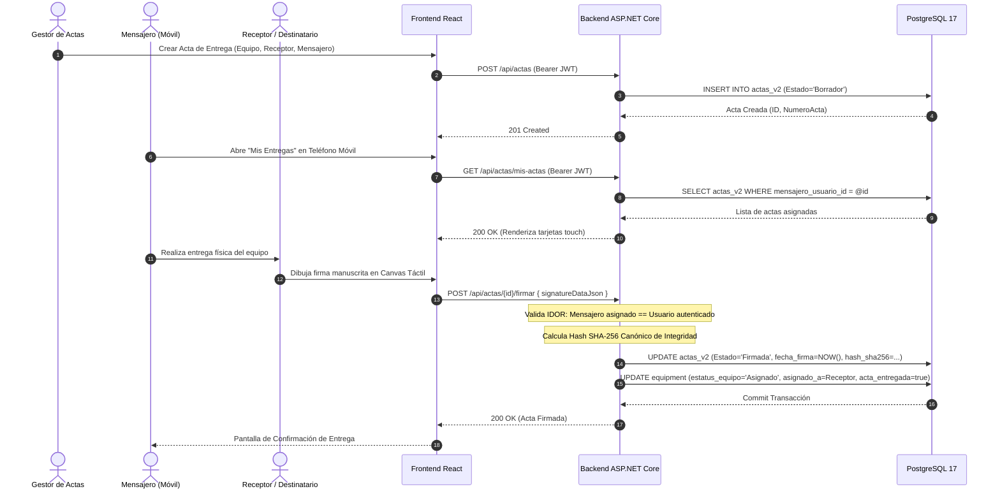
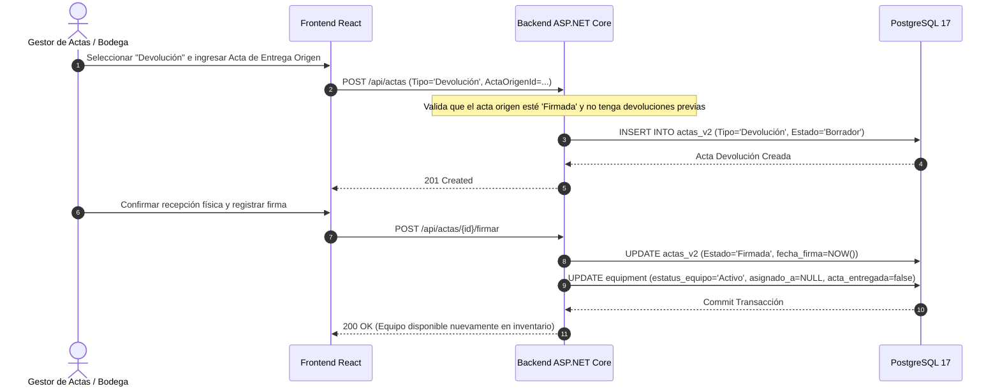

# 🔄 DIAGRAMAS DE FLUJO Y SECUENCIA

## 1. Secuencia: Flujo de Entrega Física y Firma Manuscrita

```mermaid
sequenceDiagram
    autonumber
    actor GestorTI as Gestor de Actas
    actor Mensajero as Mensajero (Móvil)
    actor Receptor as Receptor / Destinatario
    participant WebApp as Frontend React
    participant API as Backend ASP.NET Core
    participant DB as PostgreSQL 17

    GestorTI->>WebApp: Crear Acta de Entrega (Equipo, Receptor, Mensajero)
    WebApp->>API: POST /api/actas (Bearer JWT)
    API->>DB: INSERT INTO actas_v2 (Estado='Borrador')
    DB-->>API: Acta Creada (ID, NumeroActa)
    API-->>WebApp: 201 Created

    Mensajero->>WebApp: Abre "Mis Entregas" en Teléfono Móvil
    WebApp->>API: GET /api/actas/mis-actas (Bearer JWT)
    API->>DB: SELECT actas_v2 WHERE mensajero_usuario_id = @id
    DB-->>API: Lista de actas asignadas
    API-->>WebApp: 200 OK (Renderiza tarjetas touch)

    Mensajero->>Receptor: Realiza entrega física del equipo
    Receptor->>WebApp: Dibuja firma manuscrita en Canvas Táctil
    WebApp->>API: POST /api/actas/{id}/firmar { signatureDataJson }
    Note over API: Valida IDOR: Mensajero asignado == Usuario autenticado
    Note over API: Calcula Hash SHA-256 Canónico de Integridad
    API->>DB: UPDATE actas_v2 (Estado='Firmada', fecha_firma=NOW(), hash_sha256=...)
    API->>DB: UPDATE equipment (estatus_equipo='Asignado', asignado_a=Receptor, acta_entregada=true)
    DB-->>API: Commit Transacción
    API-->>WebApp: 200 OK (Acta Firmada)
    WebApp-->>Mensajero: Pantalla de Confirmación de Entrega
```

---

## 2. Secuencia: Flujo de Devolución de Hardware

```mermaid
sequenceDiagram
    autonumber
    actor GestorTI as Gestor de Actas / Bodega
    participant WebApp as Frontend React
    participant API as Backend ASP.NET Core
    participant DB as PostgreSQL 17

    GestorTI->>WebApp: Seleccionar "Devolución" e ingresar Acta de Entrega Origen
    WebApp->>API: POST /api/actas (Tipo='Devolución', ActaOrigenId=...)
    Note over API: Valida que el acta origen esté 'Firmada' y no tenga devoluciones previas
    API->>DB: INSERT INTO actas_v2 (Tipo='Devolución', Estado='Borrador')
    DB-->>API: Acta Devolución Creada
    API-->>WebApp: 201 Created

    GestorTI->>WebApp: Confirmar recepción física y registrar firma
    WebApp->>API: POST /api/actas/{id}/firmar
    API->>DB: UPDATE actas_v2 (Estado='Firmada', fecha_firma=NOW())
    API->>DB: UPDATE equipment (estatus_equipo='Activo', asignado_a=NULL, acta_entregada=false)
    DB-->>API: Commit Transacción
    API-->>WebApp: 200 OK (Equipo disponible nuevamente en inventario)
```
